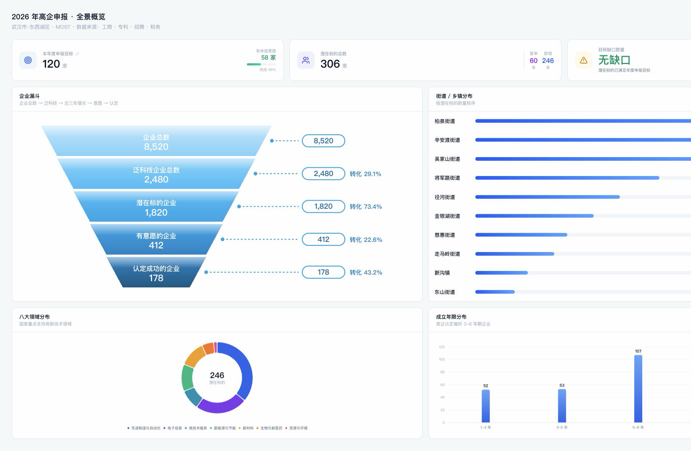
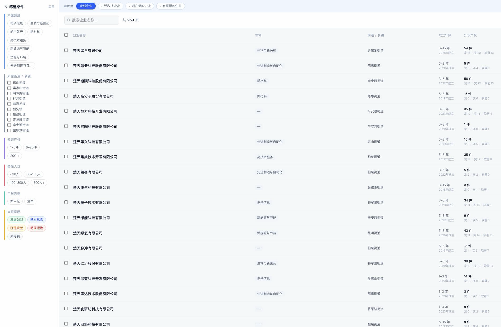
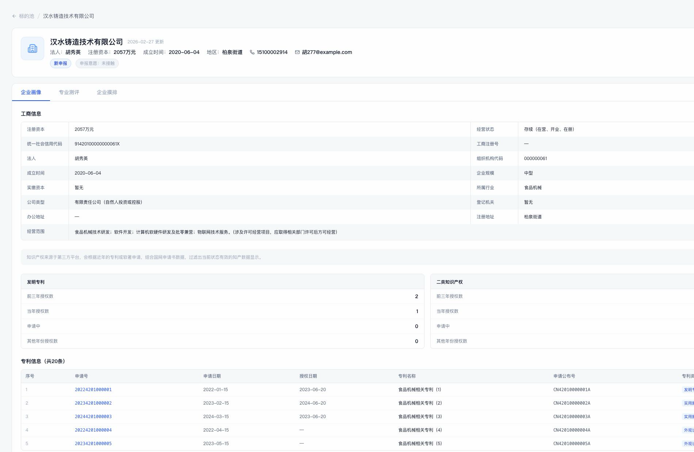
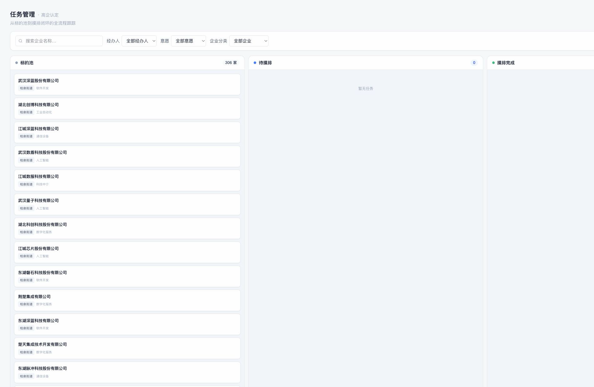
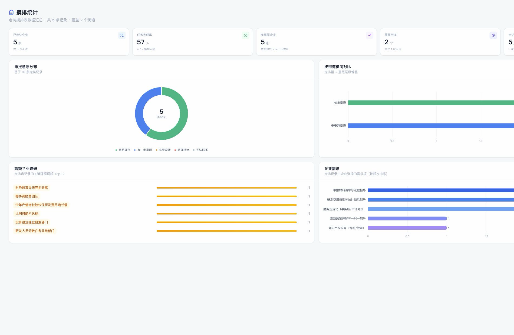
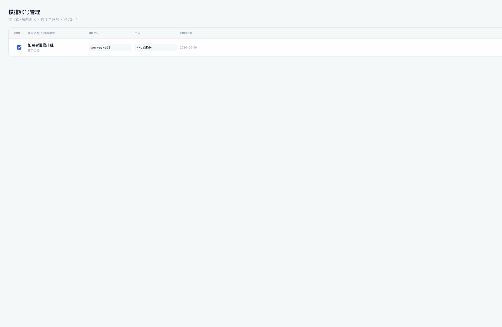
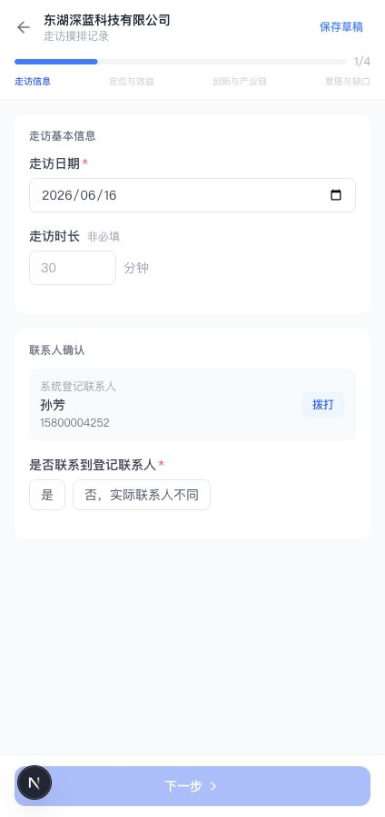
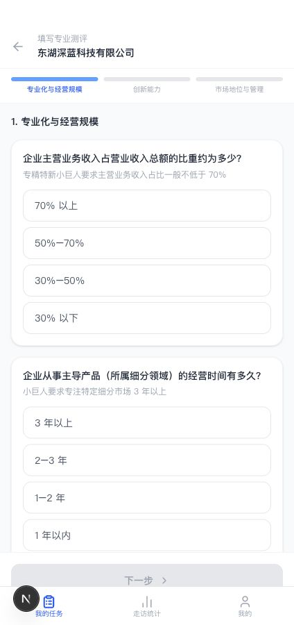
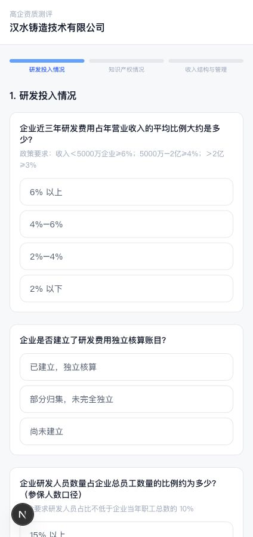
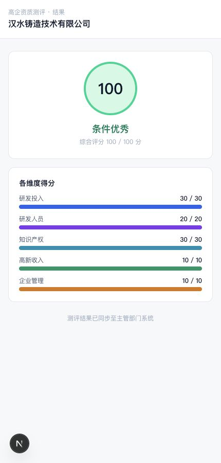

# 标的挖掘平台产品说明书

面向客户采购决策版

生成日期：2026 年 6 月 16 日

## 一、产品定位

标的挖掘平台是一套面向区县科技主管部门、园区和街道乡镇的企业培育工作系统，服务于高新技术企业及创新型中小企业、专精特新等资质的培育全过程。

平台围绕"找得到、派得下、访得清、评得准、看得见"五个环节，把分散在表格、微信群和个人电脑里的培育工作，整合为一条从企业底数梳理、潜在标的筛选、摸排任务派发、一线走访回传、企业资质测评到统计复盘的闭环。

平台的目标不是替代干部的判断，而是让筛选、派发、走访、测评和汇报这些重复性工作在同一系统内有序流转，让管理者把精力放在调度和决策上。

## 二、适用对象与典型场景

平台主要服务三类使用者：

- **主管部门（科技局、经信局等）**：制定年度培育目标，筛选标的，派发任务，掌握全局进度。
- **街道、园区及一线摸排人员**：承接任务，现场走访，回传企业真实情况。
- **辖区企业**：自助完成申报条件测评，了解自身差距。

适用的典型工作场景包括：

- 年度高新技术企业及各类资质申报的培育任务管理。
- 区县、园区、街道三级联动开展企业摸排。
- 对潜在企业分层筛选、走访记录和培育建议沉淀。
- 对企业申报条件进行结构化测评，形成可追踪的企业培育档案。

## 三、客户核心痛点与平台价值

| 工作中的实际困难 | 平台的解决方式 | 对主管部门的价值 |
| --- | --- | --- |
| 辖区企业底数大，潜在标的难以快速识别 | 按泛科技企业、潜在标的企业、有意愿企业分层管理，支持多条件组合筛选 | 快速锁定优先跟进对象，减少人工翻表和反复核对 |
| 任务靠口头或微信派发，进度难以掌握 | PC 端批量派发任务，小程序端承接执行，状态全程可见 | 责任人、任务状态和完成情况一目了然 |
| 一线走访记录分散在各人手中，数据难回流 | 小程序结构化录入走访信息、企业情况和申报意愿 | 走访过程可追溯，结果自动汇入管理端 |
| 企业是否适合申报缺少统一判断口径 | 企业自填或工作人员代填测评问卷，输出得分、等级和培育建议 | 形成统一测评依据，便于后续培育和服务 |
| 领导要看进度，但各处上报口径不一致 | 驾驶舱与摸排统计按企业、街道、意愿、障碍和需求统一聚合 | 支撑年度任务复盘、调度和资源配置 |

## 四、业务闭环

平台覆盖企业培育工作的关键链路，环环相扣：

1. **梳理底数**：辖区企业进入标的池，按技术领域、街道乡镇、申报类型、知识产权、参保和研发情况进行筛选。
2. **筛选派发**：主管部门从标的池中选定重点企业，单个或批量派发给街道、园区或摸排人员。
3. **现场走访**：摸排人员在小程序中查看任务、进入企业详情，现场记录联系人、经营情况、研发投入、申报意愿、障碍和服务需求。
4. **资质测评**：企业可通过专属链接自主完成测评，工作人员也可现场代填。
5. **汇总复盘**：PC 端汇总走访记录、测评结果、任务状态和统计图表，为后续培育、辅导和申报组织提供依据。

每个环节的产出都成为下一环节的输入，数据不重复录入，过程可追溯。

## 五、核心功能介绍

### 5.1 驾驶舱：掌握年度培育全局

驾驶舱用于主管部门快速查看年度申报目标、潜在标的数量、目标缺口、企业漏斗、街道分布、领域分布和企业成立年限等关键指标。管理者在一个页面即可判断当前培育进度、重点街道和潜在短板。

主要能力：

- 展示年度申报目标、有申报意愿企业、潜在标的总数和目标缺口。
- 展示从企业总数到认定成功的转化漏斗。
- 按街道乡镇、技术领域和成立年限分析潜在标的结构。
- 支持按不同资质类型查看对应培育目标和标的情况。

{width=6.5in}

图 1：驾驶舱展示年度目标、潜在标的和区域分布。

### 5.2 标的池：快速筛选重点企业

标的池是主管部门开展企业培育的主工作区。用户可以从企业池中筛选泛科技企业、潜在标的企业和有意愿企业，并按企业名称、统一社会信用代码、技术领域、街道乡镇、申报类型、申报意愿等条件组合查询。

主要能力：

- 按企业层级切换企业池，聚焦不同阶段的培育对象。
- 支持多条件筛选、搜索、排序和批量选择。
- 支持将筛选结果导出，便于线下复核和汇报。
- 支持单个或批量派发，直接进入摸排任务闭环。

{width=6.5in}

图 2：标的池支持分层筛选、批量选择和任务派发。

### 5.3 企业详情：沉淀企业画像与培育档案

企业详情页用于集中查看企业基础信息、工商信息、知识产权、专利明细、测评状态和摸排记录。它既是单个企业的画像页，也是后续培育服务的档案页。

主要能力：

- 展示企业名称、法人、注册资本、成立时间、联系方式、地区和申报意愿。
- 展示工商信息、知识产权数量、专利、软著、商标和备案信息。
- 展示测评链接、测评结果、答题详情和培育建议。
- 展示历次走访摸排记录，便于连续跟进。

{width=6.5in}

图 3：企业详情集中展示企业画像、知识产权和后续跟进信息。

### 5.4 任务管理：把标的转成可执行任务

任务管理采用看板方式呈现标的池、待摸排和已完成任务。主管部门可以从标的池派发企业，也可以通过看板查看任务状态，及时发现未推进或需协调的企业。

主要能力：

- 三列看板展示任务流转状态。
- 支持从标的池派发企业到经办人。
- 支持按企业名称、经办单位、经办人和申报意愿筛选。
- 支持查看任务详情和走访结果。

{width=6.5in}

图 4：任务看板帮助主管部门跟踪派发、摸排和完成情况。

### 5.5 摸排统计：汇总走访结果与企业需求

摸排统计将一线走访结果汇总为可分析的管理视图，帮助主管部门掌握已走访企业数量、任务完成率、有意愿企业数量、街道覆盖情况、申报意愿分布、企业主要障碍和服务需求。

主要能力：

- 展示已走访企业、任务完成率、有意愿企业、覆盖街道和走访总次数。
- 按申报意愿展示企业分布。
- 按街道横向对比走访量和意愿层级。
- 汇总企业高频障碍和服务需求，支撑后续政策辅导安排。

{width=6.5in}

图 5：摸排统计用于复盘走访进度、企业意愿和服务需求。

### 5.6 摸排账号管理：统一分发一线账号

主管部门可以在 PC 端统一创建、启用、禁用和管理摸排账号，并将账号凭证分发给街道或一线摸排人员。账号权限与任务范围联动，便于控制数据可见范围。

主要能力：

- 新建摸排账号并自动生成用户名和密码。
- 编辑账号名称和所属单位。
- 启用、禁用、重置密码和删除账号。
- 复制单个或全部账号凭证，导出账号列表。

{width=6.5in}

图 6：摸排账号由 PC 端统一创建和分发。

### 5.7 摸排小程序：一线人员移动执行

摸排小程序面向街道、园区和一线摸排人员，承接 PC 端派发的任务。用户登录后可以查看本人或所属街道的任务，按状态筛选，进入企业详情并完成走访记录。

主要能力：

- 查看全部、待摸排和已完成任务。
- 按企业名称搜索任务。
- 查看企业基础信息、联系人、知识产权和历史走访记录。
- 从任务直接进入走访记录或企业测评。

{width=2.65in}

图 7：一线人员在小程序中查看和处理摸排任务。

### 5.8 走访记录：结构化回传现场信息

走访记录采用分步骤表单，帮助摸排人员在现场记录企业联系人、经营情况、研发投入、申报意愿、障碍需求和后续跟进事项。提交后，数据自动进入 PC 端企业详情和统计页面。

主要能力：

- 记录走访日期、时长、联系人和联系方式。
- 核实企业规模、研发人员、营收规模、研发费用和财务情况。
- 记录申报意愿、主要障碍、企业需求和内部备注。
- 支持预览后提交，减少信息漏填。

{width=2.65in}

图 8：走访表单将现场信息转化为统一数据。

### 5.9 企业测评：统一判断申报基础条件

测评能力支持两类路径：企业联系人通过专属链接自主填写，或工作人员在现场代填。测评围绕研发投入、知识产权、收入结构与管理等维度组织，提交后形成得分、等级和培育建议。

主要能力：

- PC 端或小程序端为企业生成专属测评链接。
- 企业联系人可在手机端打开链接完成问卷。
- 工作人员可在小程序端现场代填。
- 测评结果同步回管理端，沉淀为企业培育档案。

{width=2.65in}

图 9：工作人员可现场帮助企业完成测评。

{width=2.65in}

图 10：企业联系人可通过专属链接自主完成测评问卷。

{width=2.65in}

图 11：测评结果展示等级、维度得分和培育建议。

## 六、典型使用场景

### 场景一：区县科技局开展年度高企培育

主管部门通过驾驶舱查看年度目标和目标缺口，从标的池筛选潜在企业，按街道或经办人批量派发摸排任务。一线人员走访后，系统汇总申报意愿、障碍和需求，形成后续辅导清单。

### 场景二：街道集中摸排辖区企业

街道账号登录小程序，查看所属街道任务列表，对企业逐一走访并填写记录。主管部门可以实时看到走访结果，减少线下表格收集和重复沟通。

### 场景三：企业自助完成申报条件测评

工作人员为企业生成专属测评链接，企业联系人在手机上填写问卷并查看结果。测评完成后，主管部门在企业详情中查看测评结果和培育建议，判断是否纳入重点培育名单。

## 七、采购价值

标的挖掘平台的采购价值体现在四个方面：

1. **提升标的发现效率**：将企业池按培育阶段分层，快速锁定重点对象，减少人工翻表和反复核对。
2. **提升摸排组织效率**：任务派发、执行、回传和统计在同一系统内完成，责任到人、进度可见。
3. **提升数据沉淀质量**：企业画像、走访记录和测评结果形成连续档案，人员变动不丢失工作积累。
4. **提升管理决策能力**：用驾驶舱和统计视图支撑年度目标管理、街道调度和政策服务安排。

平台聚焦把现有培育工作做得更有条理、更可追踪，不替代主管部门的业务判断，而是为判断提供更完整、更及时的依据。

## 八、数据安全与权限管理

平台面向政务场景设计，重视数据可控：

- **分级账号体系**：区分管理员、主管部门和一线摸排人员，不同角色可见的数据范围不同。
- **账号统一管控**：摸排账号由 PC 端统一创建、启用、禁用、重置和删除，离岗人员可及时停用。
- **数据范围隔离**：一线人员仅可见本人或所属街道的任务，避免数据越权访问。
- **操作留痕**：走访记录、测评结果和任务状态均带有提交主体和时间，便于追溯。

具体的部署方式（本地化部署或专网部署）、数据存储位置和等保要求，可结合采购方信息化规范在实施阶段进一步明确。

## 九、试点建议

建议以一个区县或若干街道作为首批试点，控制范围、快速见效：

1. 导入辖区企业基础数据和初始标的池。
2. 配置主管部门账号和摸排账号。
3. 选取一批重点企业开展筛选、派发、走访和测评。
4. 试点结束后输出企业意愿清单、障碍需求清单和重点培育清单。
5. 基于试点结果扩展到更多街道、园区和资质类型。

试点周期内即可形成可向上汇报的阶段性成果，降低一次性全面铺开的决策风险。

## 十、交付范围建议

首期建议交付以下业务端能力：

| 端 | 建议交付模块 |
| --- | --- |
| 政府 PC 端 | 登录、驾驶舱、标的池、企业详情、任务管理、摸排统计、摸排账号管理 |
| 摸排小程序 | 登录、我的任务、企业详情、走访记录、企业测评、走访统计、我的 |
| 企业公开测评端 | 测评链接访问、问卷填写、提交、结果展示、培育建议 |

首期上线后，可先服务年度高企培育闭环；后续根据客户需要扩展更多资质类型、更多统计口径和更精细的数据治理能力。
